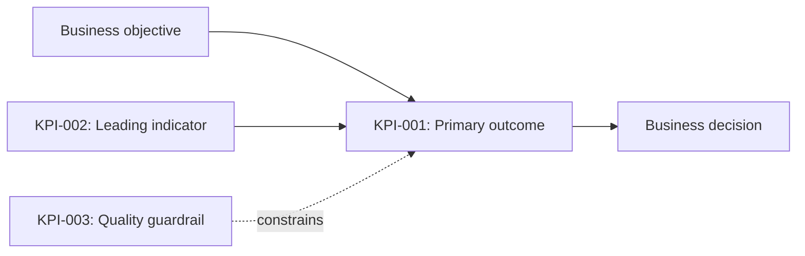
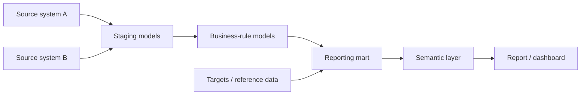

<div align="center">

# 📊 [Report Name]

### KPI Blueprint & Measurement Specification

**Version `0.1.0`** · **Status: 🟡 Draft** · **Owner: [Team or Owner]**

<sub>One trusted definition for every metric—from business intent to production SQL.</sub>

</div>

---

> [!IMPORTANT]
> This blueprint is the source of truth for the report's KPI definitions. Any change to a KPI's business meaning, calculation, grain, filters, or source data must be reflected here and reviewed before release.

## Document control

| Field | Value |
|---|---|
| **Report** | [Report name] |
| **Report ID** | `[REPORT-000]` |
| **Business owner** | [Name / team] |
| **Technical owner** | [Name / team] |
| **Data steward** | [Name / team] |
| **Version** | `0.1.0` |
| **Status** | 🟡 Draft |
| **Last updated** | YYYY-MM-DD |
| **Next review** | YYYY-MM-DD |
| **Data classification** | [Internal / Confidential / Restricted] |
| **Related issue / ticket** | [#000 or URL] |

### Status legend

| Status | Meaning |
|---|---|
| ⚪ Proposed | Definition is being explored |
| 🟡 Draft | Definition is documented but not approved |
| 🔵 In review | Business and technical review is underway |
| 🟢 Approved | Authorized for production use |
| 🟠 Deprecated | Supported temporarily; replacement identified |
| ⚫ Retired | No longer calculated or displayed |

## Quick navigation

- [1. Executive summary](#1-executive-summary)
- [2. Report scope](#2-report-scope)
- [3. KPI catalog](#3-kpi-catalog)
- [4. KPI specifications](#4-kpi-specifications)
- [5. Data model and lineage](#5-data-model-and-lineage)
- [6. SQL implementation](#6-sql-implementation)
- [7. Data quality and validation](#7-data-quality-and-validation)
- [8. Report behavior and presentation](#8-report-behavior-and-presentation)
- [9. Security and governance](#9-security-and-governance)
- [10. Operations and monitoring](#10-operations-and-monitoring)
- [11. Acceptance and sign-off](#11-acceptance-and-sign-off)
- [12. Change log](#12-change-log)
- [Appendix](#appendix)

---

## 1. Executive summary

### Purpose

[In 2–4 sentences, explain the business decision this report supports, who uses it, and why the KPIs matter.]

### Intended audience

| Audience | Primary question answered | Expected action |
|---|---|---|
| [Executive leadership] | [Are we on target?] | [Prioritize investment] |
| [Operations] | [Where is intervention needed?] | [Investigate and correct] |
| [Analytics] | [What explains the movement?] | [Perform deeper analysis] |

### Success criteria

- [ ] Users can answer **[key business question]** without manual reconciliation.
- [ ] Approved KPIs match the authoritative source within **[tolerance]**.
- [ ] Data is available by **[time and timezone]** on **[schedule]**.
- [ ] Report performance meets **[target load time]**.

### At-a-glance KPI portfolio

| KPI | Current value | Target | Trend | Status | Decision supported |
|---|---:|---:|:---:|:---:|---|
| [KPI 01] | [—] | [—] | ↗ | 🟢 | [Decision] |
| [KPI 02] | [—] | [—] | → | 🟡 | [Decision] |
| [KPI 03] | [—] | [—] | ↘ | 🔴 | [Decision] |

> [!NOTE]
> Values above are optional. Use this table as a design preview or populate it automatically in generated documentation.

---

## 2. Report scope

### In scope

- [Business process, population, product, region, or channel]
- [Included reporting periods]
- [Included organizational units]

### Out of scope

- [Explicitly excluded population or use case]
- [Known adjacent metric/report that is not replaced]

### Business questions

1. [Primary question]
2. [Secondary question]
3. [Diagnostic question]

### Reporting parameters

| Parameter | Definition |
|---|---|
| **Reporting grain** | [Daily / weekly / monthly / transaction / customer] |
| **Default date range** | [e.g., trailing 13 complete months] |
| **Timezone** | [e.g., America/Chicago] |
| **Currency** | [e.g., USD; state conversion policy] |
| **Refresh cadence** | [e.g., daily by 07:00 CT] |
| **Data latency** | [e.g., T+1] |
| **History available from** | YYYY-MM-DD |
| **Primary comparison** | [Prior period / prior year / target / benchmark] |

### Assumptions and constraints

| ID | Assumption or constraint | Impact | Owner | Review date |
|---|---|---|---|---|
| `A-01` | [Assumption] | [Impact if false] | [Owner] | YYYY-MM-DD |
| `C-01` | [Constraint] | [Design implication] | [Owner] | YYYY-MM-DD |

---

## 3. KPI catalog

Use one stable `kpi_id` everywhere: this blueprint, SQL models, semantic layers, tests, dashboards, and tickets.

| KPI ID | KPI name | Category | Unit | Direction | Grain | Owner | Status |
|---|---|---|---|:---:|---|---|:---:|
| `KPI-001` | [KPI name] | [Growth / Quality / Efficiency] | [% / $ / count / days] | ↑ | [Month × Region] | [Owner] | 🟡 |
| `KPI-002` | [KPI name] | [Category] | [Unit] | ↓ | [Grain] | [Owner] | 🟡 |
| `KPI-003` | [KPI name] | [Category] | [Unit] | ↔ | [Grain] | [Owner] | 🟡 |

**Direction key:** ↑ higher is better · ↓ lower is better · ↔ target range is best

### KPI relationship map



---

## 4. KPI specifications

> [!TIP]
> Copy the complete subsection below for every KPI. Do not combine KPIs that differ in grain, population, filters, timing, or aggregation behavior.

### KPI-001 · [KPI name]

> **Plain-language definition**  
> [Describe the metric in one sentence that a new business user can understand.]

| Attribute | Specification |
|---|---|
| **KPI ID** | `KPI-001` |
| **Business name** | [Display name] |
| **Technical name** | `snake_case_metric_name` |
| **Business objective** | [Objective supported] |
| **Business question** | [Question this KPI answers] |
| **Metric type** | [Outcome / driver / guardrail / diagnostic] |
| **Unit / format** | [%, currency, count, decimal, duration] |
| **Desired direction** | [Higher / lower / target range] |
| **Owner** | [Accountable business owner] |
| **Data steward** | [Definition/data quality contact] |
| **Certification status** | [Proposed / Draft / Approved / Deprecated] |

#### Calculation contract

| Component | Definition |
|---|---|
| **Formula** | $\displaystyle KPI = \frac{\text{Numerator}}{\text{Denominator}} \times 100$ |
| **Numerator** | [Exact qualifying event/population and field] |
| **Denominator** | [Exact eligible population and field] |
| **Aggregation** | [SUM / COUNT / COUNT DISTINCT / AVG / weighted average / snapshot] |
| **Base grain** | [One row per …] |
| **Reporting grain** | [Dimensions at which KPI is valid] |
| **Time basis** | [Event date / posting date / snapshot date / fiscal period] |
| **Window** | [Point-in-time / MTD / QTD / YTD / rolling N days] |
| **Rounding** | [e.g., calculate at full precision; display 1 decimal] |
| **Null behavior** | [Exclude / treat as zero / unknown category] |
| **Zero denominator** | [Return NULL / 0 / not applicable] |
| **Duplicate policy** | [Deduplication key and winning-record rule] |
| **Late-arriving data** | [Restatement window and handling] |

#### Population rules

**Include when all are true**

- [ ] `[field] = [value]`
- [ ] `[date_field]` is within the reporting window
- [ ] [Business eligibility rule]

**Exclude when any are true**

- [ ] [Test, training, canceled, fraud, or other excluded records]
- [ ] `[field] IN ([excluded values])`
- [ ] [Business exclusion rule]

#### Dimensions and slice behavior

| Dimension | Source field | Allowed? | Null label | Notes |
|---|---|:---:|---|---|
| Date | `[table].[date_field]` | ✅ | N/A | [Calendar/fiscal behavior] |
| Region | `[table].[region]` | ✅ | Unknown | [Assignment rule] |
| Product | `[table].[product]` | ✅ | Unmapped | [Hierarchy/version] |
| [Dimension] | `[table].[field]` | ❌ | — | [Why slicing is invalid] |

#### Targets and thresholds

| Band | Rule | Display | Interpretation |
|---|---|:---:|---|
| On target | `value >= [target]` | 🟢 | [Expected performance] |
| Watch | `[lower] <= value < [target]` | 🟡 | [Attention recommended] |
| Off target | `value < [lower]` | 🔴 | [Action required] |

**Target source:** [Plan table, approved spreadsheet, policy, or owner]  
**Target grain:** [Period × region × product]  
**Effective dates:** [How target versions are applied]

#### Comparison logic

| Comparison | Definition | Edge-case handling |
|---|---|---|
| Period over period | `(current - prior) / prior` | [Prior = 0 or missing] |
| Year over year | [Aligned fiscal/calendar period] | [Partial periods] |
| Variance to target | `current - target` | [Missing targets] |

#### Worked example

| Input | Value |
|---|---:|
| Eligible population | 1,250 |
| Qualifying outcomes | 1,075 |
| Calculation | `1,075 / 1,250 × 100` |
| **Expected KPI** | **86.0%** |

#### Edge cases

| Scenario | Expected behavior | Test reference |
|---|---|---|
| Denominator is zero | [Return NULL and display “—”] | `TEST-KPI001-01` |
| Record changes after close | [Restate last N periods] | `TEST-KPI001-02` |
| Dimension is unmapped | [Retain as “Unmapped”] | `TEST-KPI001-03` |

#### Dependencies and caveats

- **Depends on:** [Upstream model, mapping, target, or reference data]
- **Known limitations:** [What users must not infer from the KPI]
- **Do not use for:** [Invalid decisions, slices, or comparisons]
- **Reconciliation source:** [System/report and expected tolerance]

<details>
<summary><strong>Review checklist for KPI-001</strong></summary>

- [ ] Business definition is unambiguous.
- [ ] Numerator and denominator are independently reproducible.
- [ ] Grain and valid dimensions are explicit.
- [ ] Inclusion, exclusion, null, duplicate, and timing rules are documented.
- [ ] Worked example matches the production calculation.
- [ ] Business owner and data steward approved the definition.

</details>

---

## 5. Data model and lineage

### Source inventory

| Layer | Object | Purpose | Grain / key | Update cadence | Owner |
|---|---|---|---|---|---|
| Source | `[database].[schema].[table]` | [System-of-record data] | `[primary_key]` | [Cadence] | [Owner] |
| Staging | `[schema].[stg_model]` | [Standardization/deduplication] | [Grain] | [Cadence] | [Owner] |
| Intermediate | `[schema].[int_model]` | [Business transformation] | [Grain] | [Cadence] | [Owner] |
| Mart | `[schema].[fct_report]` | [Report-ready facts] | [Grain] | [Cadence] | [Owner] |
| Semantic | `[dataset].[measure]` | [KPI presentation] | [Grain] | [Cadence] | [Owner] |

### Field-level lineage

| KPI component | Source field(s) | Transformation | Output field |
|---|---|---|---|
| Numerator | `[source].[field]` | [Rule / CASE expression] | `kpi_001_numerator` |
| Denominator | `[source].[field]` | [Eligibility rule] | `kpi_001_denominator` |
| KPI value | Derived | `numerator / NULLIF(denominator, 0)` | `kpi_001_value` |

### Lineage diagram



### Join contracts

| Left object | Right object | Join type | Join key | Expected cardinality | Unmatched handling |
|---|---|---|---|---|---|
| `[fact]` | `[dimension]` | LEFT | `[dimension_key]` | Many-to-one | Retain as `Unknown` |

> [!WARNING]
> Document every join that can multiply fact rows. If many-to-many behavior is intentional, state the allocation or bridge-table rule explicitly.

---

## 6. SQL implementation

### Repository map

```text
reports/[report_slug]/
├── README.md
├── KPI_BLUEPRINT.md
├── sql/
│   ├── 00_sources.sql
│   ├── 10_staging.sql
│   ├── 20_business_rules.sql
│   ├── 30_kpi_metrics.sql
│   └── 90_validation.sql
├── tests/
│   ├── test_kpi_001.sql
│   └── expected/
├── docs/
│   └── data_dictionary.md
└── artifacts/
    └── [report screenshots or exports]
```

### Canonical KPI query

> Replace this sample with the smallest executable query that proves the KPI definition. Reference production models instead of duplicating transformation logic when possible.

```sql
-- KPI-001: [KPI name]
-- Grain: one row per [period, dimension]
-- Owner: [team]

with eligible_population as (
    select
        reporting_period,
        dimension_key,
        record_id,
        case when [qualifying_condition] then 1 else 0 end as is_qualifying
    from [database].[schema].[source_table]
    where [eligibility_condition]
      and not [exclusion_condition]
),

aggregated as (
    select
        reporting_period,
        dimension_key,
        count(distinct record_id) as denominator,
        count(distinct case when is_qualifying = 1 then record_id end) as numerator
    from eligible_population
    group by
        reporting_period,
        dimension_key
)

select
    reporting_period,
    dimension_key,
    numerator,
    denominator,
    1.0 * numerator / nullif(denominator, 0) as kpi_001_value
from aggregated;
```

### SQL-to-KPI traceability

| KPI ID | Production model | Measure / column | Validation query | Test owner |
|---|---|---|---|---|
| `KPI-001` | `[schema].[model]` | `kpi_001_value` | `sql/90_validation.sql` | [Owner] |

### Performance expectations

| Measure | Target | Observed | Tested on |
|---|---:|---:|---|
| Model runtime | ≤ [N] minutes | [—] | YYYY-MM-DD |
| Report query time | ≤ [N] seconds | [—] | YYYY-MM-DD |
| Rows scanned / processed | ≤ [N] | [—] | YYYY-MM-DD |

---

## 7. Data quality and validation

### Quality controls

| Test ID | Control | Scope | Expected result | Severity | Frequency |
|---|---|---|---|:---:|---|
| `DQ-001` | Primary key uniqueness | `[model].[key]` | 0 duplicates | 🔴 Critical | Every run |
| `DQ-002` | Required fields | [Critical columns] | 0 unexpected nulls | 🔴 Critical | Every run |
| `DQ-003` | Accepted values | `[status]` | Only approved domain | 🟠 High | Every run |
| `DQ-004` | Referential integrity | Fact → dimension | ≥ [99.9%] matched | 🟠 High | Every run |
| `DQ-005` | Freshness | Latest source timestamp | ≤ [N] hours old | 🔴 Critical | Every run |
| `DQ-006` | Volume anomaly | Daily row count | Within [±N%] baseline | 🟡 Medium | Daily |
| `DQ-007` | KPI reconciliation | KPI-001 | Within [tolerance] | 🔴 Critical | Release |

### Reconciliation plan

| KPI | Comparison source | Period | Expected tolerance | Result | Evidence |
|---|---|---|---:|:---:|---|
| `KPI-001` | [Authoritative report/system] | [Period] | ±[0.1%] | ⬜ | [Link/path] |

### Validation scenarios

| Test ID | Given | When | Then | Result |
|---|---|---|---|:---:|
| `TEST-KPI001-01` | No eligible records | KPI is calculated | Value is NULL / “—” | ⬜ |
| `TEST-KPI001-02` | Known fixture dataset | KPI is calculated | Value equals [expected] | ⬜ |
| `TEST-KPI001-03` | Duplicate source rows | Deduplication runs | One canonical record remains | ⬜ |

### Release gates

- [ ] All critical tests pass.
- [ ] Reconciliation is within approved tolerance.
- [ ] No unexplained material period-over-period movement.
- [ ] Data freshness meets the service-level target.
- [ ] Business owner has approved sample outputs.

---

## 8. Report behavior and presentation

### Pages and user flow

| Page / view | Purpose | KPIs shown | Default filters | Primary action |
|---|---|---|---|---|
| Executive overview | [Summary] | KPI-001, KPI-002 | [Period] | [Identify status] |
| Trend analysis | [Movement over time] | KPI-001 | [Trailing 13 months] | [Explain trend] |
| Detail | [Root-cause analysis] | [Supporting measures] | [Inherited] | [Investigate] |

### Global filters

| Filter | Default | Selection mode | Applies to | Notes |
|---|---|---|---|---|
| Reporting period | [Latest complete period] | Single / range | All pages | [Partial-period policy] |
| Region | All | Multi-select | All pages | [RLS interaction] |
| Product | All | Multi-select | [Pages] | [Hierarchy behavior] |

### Display standards

| Element | Standard |
|---|---|
| Percentage | [1 decimal; e.g., 86.0%] |
| Currency | [Symbol, scale, decimals; e.g., $1.2M] |
| Missing value | Em dash `—`, never zero unless zero is factual |
| Positive / negative | [Define color and sign convention] |
| Date | [e.g., `MMM YYYY`] |
| Tooltip | Definition, period, numerator, denominator, last refresh |
| Accessibility | Do not rely on color alone; use labels/icons and sufficient contrast |

### Interaction rules

- [Cross-filter and drill-through behavior]
- [Export behavior and row limits]
- [What happens when no data matches filters]
- [Mobile or small-screen requirements]

---

## 9. Security and governance

| Control | Specification |
|---|---|
| **Data classification** | [Classification] |
| **Authorized audience** | [Groups/roles] |
| **Row-level security** | [Rule and entitlement source] |
| **Column masking** | [Sensitive columns and masking policy] |
| **PII / PHI / PCI** | [Fields present or “None”] |
| **Retention** | [Policy] |
| **Export restrictions** | [Allowed / restricted behavior] |
| **Audit requirement** | [Access/change logging] |

### Governance checklist

- [ ] Least-privilege access is configured.
- [ ] Sensitive fields are excluded, masked, or approved.
- [ ] Row-level security has positive and negative test cases.
- [ ] Retention and export behavior comply with policy.
- [ ] Metric owner and steward are recorded in the catalog.

---

## 10. Operations and monitoring

### Service levels

| Commitment | Target | Escalation owner |
|---|---|---|
| Data available | [Time, timezone, schedule] | [Owner] |
| Maximum latency | [T+N / hours] | [Owner] |
| Availability | [e.g., 99.5% during business hours] | [Owner] |
| Incident response | [Severity-based target] | [Owner] |

### Pipeline dependencies

| Dependency | Expected completion | Failure impact | Recovery / fallback |
|---|---|---|---|
| [Upstream job/model] | [Time] | [Impact] | [Runbook action] |

### Monitoring and alerts

| Alert | Trigger | Severity | Channel | Runbook |
|---|---|:---:|---|---|
| Freshness breach | Source age > [N] hours | 🔴 | [Channel] | [Link/path] |
| KPI anomaly | Change > [N%] | 🟠 | [Channel] | [Link/path] |
| Pipeline failure | Job status = failed | 🔴 | [Channel] | [Link/path] |

### Incident communication

**User-facing banner template**

> Data for **[affected period/KPI]** is delayed due to **[brief reason]**. The last verified refresh was **[timestamp and timezone]**. Next update: **[time]**. Contact: **[owner/channel]**.

---

## 11. Acceptance and sign-off

### Definition of done

- [ ] Every production KPI has a complete specification.
- [ ] SQL objects and columns map to stable KPI IDs.
- [ ] Automated quality tests and reconciliation queries pass.
- [ ] Security requirements have been tested.
- [ ] Performance and refresh targets are met.
- [ ] Documentation, runbook, and ownership are current.
- [ ] Business and technical approvals are recorded below.

### Approvals

| Role | Name | Decision | Date | Evidence / notes |
|---|---|:---:|---|---|
| Business owner | [Name] | ⬜ Pending | YYYY-MM-DD | [PR review / ticket] |
| Technical owner | [Name] | ⬜ Pending | YYYY-MM-DD | [PR review / ticket] |
| Data steward | [Name] | ⬜ Pending | YYYY-MM-DD | [PR review / ticket] |
| Security / compliance | [Name or N/A] | ⬜ Pending | YYYY-MM-DD | [Evidence] |

---

## 12. Change log

Follow [Semantic Versioning](https://semver.org/) for the blueprint:

- **MAJOR:** KPI meaning, population, grain, or historical comparability changes.
- **MINOR:** New KPI, dimension, or backward-compatible capability.
- **PATCH:** Clarification, correction, or non-semantic documentation change.

| Version | Date | Author | KPI(s) | Change | Compatibility | Approval |
|---|---|---|---|---|---|---|
| `0.1.0` | YYYY-MM-DD | [Author] | All | Initial draft | N/A | Pending |

### Open decisions

| Decision ID | Question | Options | Decision owner | Due date | Status |
|---|---|---|---|---|:---:|
| `DEC-001` | [Question] | [A / B / C] | [Owner] | YYYY-MM-DD | Open |

---

## Appendix

### A. Glossary

| Term | Definition | Source / owner |
|---|---|---|
| [Business term] | [Unambiguous definition] | [Source] |

### B. Artifact index

| Artifact | Location | Purpose |
|---|---|---|
| Production SQL | [`sql/`](./sql/) | KPI transformation logic |
| Validation SQL | [`sql/90_validation.sql`](./sql/90_validation.sql) | Reconciliation and DQ checks |
| Tests | [`tests/`](./tests/) | Automated KPI test cases |
| Data dictionary | [`docs/data_dictionary.md`](./docs/data_dictionary.md) | Field definitions |
| Runbook | [`docs/runbook.md`](./docs/runbook.md) | Operational support |

### C. References

- [Business policy or metric standard]
- [Source-system documentation]
- [Architecture decision record]
- [Related report or dashboard]

### D. Template maintenance notes

1. Duplicate this file into the report folder and rename it `KPI_BLUEPRINT.md`.
2. Replace every bracketed placeholder and all `YYYY-MM-DD` values before review.
3. Copy the full **KPI specifications** subsection once per KPI.
4. Keep SQL in versioned `.sql` files; use this document for the contract and traceability.
5. Require pull-request review from the business owner and technical owner for semantic changes.
6. Update the version, `last_updated` field, and change log in the same commit as the KPI change.

---

<div align="center">

**End of blueprint**

<sub>[Organization or analytics team] · Questions: [contact/channel]</sub>

</div>
